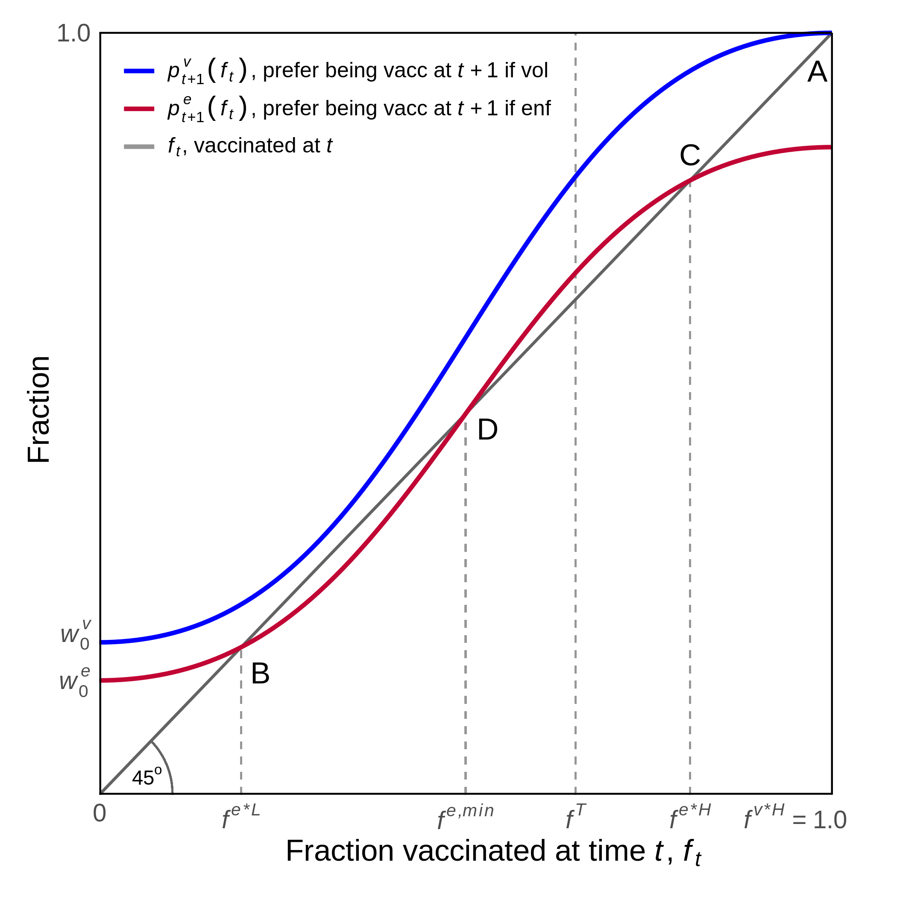
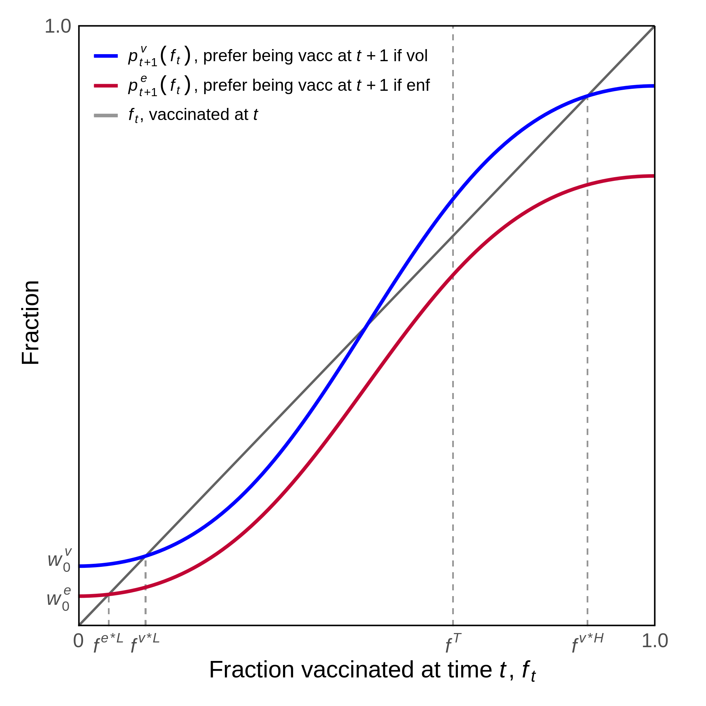

## Increased opposition to enforced COVID-19 vaccination: Policy lessons from cultural evolution.

Authors: Katrin Schmelz and Samuel Bowles

*Keywords*: Trust, crowding out, control aversion, conformism, cultural evolution.

This code provides Figure 2, Panel A and B, as well as other figures.

  
   

